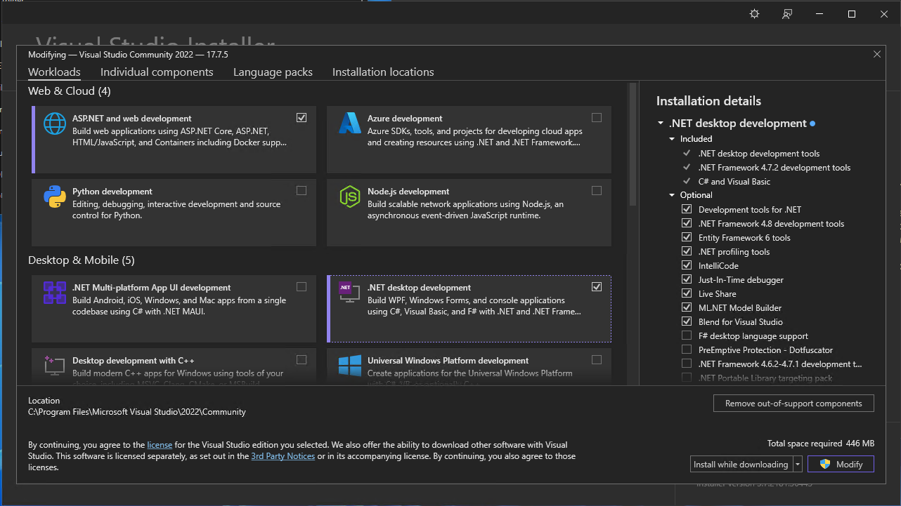

<!-- omit in toc -->

# Contributing to MMIP

<!-- omit in toc -->

## Table of Contents

- [Contributing to MMIP](#contributing-to-mmip)
  - [Table of Contents](#table-of-contents)
  - [Styleguides](#styleguides)
    - [Commit Messages](#commit-messages)
  - [Making changes](#making-changes)
  - [Setting up for Windows](#setting-up-for-windows)
    - [Using Visual Studio](#using-visual-studio)
    - [Installing the requirements automatically](#installing-the-requirements-automatically)
    - [Installing the requirements manually](#installing-the-requirements-manually)
    - [Before running the project](#before-running-the-project)

## Styleguides

### Commit Messages

Commit messages follow the [Conventional Commits](https://www.conventionalcommits.org/en/v1.0.0/) specification. This is enforced in the project by use of [commitlint](https://commitlint.js.org/#/) and [husky](https://typicode.github.io/husky/).

A commit message can be one of the following types (from the [Angular Guidelines](https://github.com/angular/angular/blob/22b96b9/CONTRIBUTING.md#type)):

- **build**: Changes that affect the build system or external dependencies (example scopes: gulp, broccoli, npm)
- **ci**: Changes to our CI configuration files and scripts (example scopes: Travis, Circle, BrowserStack, SauceLabs)
- **docs**: Documentation only changes
- **feat**: A new feature
- **fix**: A bug fix
- **perf**: A code change that improves performance
- **refactor**: A code change that neither fixes a bug nor adds a feature
- **style**: Changes that do not affect the meaning of the code (white-space, formatting, missing semi-colons, etc)
- **test**: Adding missing tests or correcting existing tests

A commit message should be structured as follows:

```
type(scope?): subject
body?
footer?
```
When referencing a Jira item, mention the issue key in the scope like so:
```
docs(MAT-69): creating the best contributing.md ever
```

## Making changes

Make sure to follow the following process when making changes to the project:

1. Create a new branch from the `main` branch.
2. Make your changes.
3. Commit your changes using the specification described in [Commit Messages](#commit-messages).
4. Push your changes to your branch.
5. Create a pull request to merge your branch into `main`.
6. Wait for the pull request to be reviewed by atleast two reviewers.
   1. Resolve any comments made by the reviewers.
   2. Repeat steps 2-6 until the pull request is approved.
   3. Squash and merge your pull request into `main`. Your branch will automatically be deleted

## Setting up for Windows

- Clone the repository to your local machine.
  - **RECOMMENDED** If you are using a new version of Windows 11, try setting up a Dev Drive and clone your repository to it by following the [Microsoft guide](https://learn.microsoft.com/en-us/windows/dev-drive/).

### Using Visual Studio
- You can install Visual Studio 2022 from [here](https://visualstudio.microsoft.com/vs/).
- When installing Visual Studio, or modifying your exisiting installation, make sure to select the "**ASP.NET and web development**" and "**.NET desktop development"** workload.


<!-- - Install WSL2 and Ubuntu using the following commands, or follow the [Microsoft guide](https://learn.microsoft.com/en-us/windows/wsl/install):
  - `wsl --install`
  - `wsl --set-default-version 2`
  - `wsl --set-default Ubuntu`
- Install [Docker Desktop](https://www.docker.com/products/docker-desktop) and configure it to use WSL 2 backend. See [guide](https://docs.docker.com/desktop/wsl/)
  - Follow the usual installation instructions to install Docker Desktop. Depending on which version of Windows you are using, Docker Desktop may prompt you to turn on WSL 2 during installation. Read the information displayed on the screen and turn on the WSL 2 feature to continue.
  - Start Docker Desktop from the **Windows Start** menu.
  - Navigate to **Settings**.
  - From the **General** tab, select **Use WSL 2 based engine**..
    - If you have installed Docker Desktop on a system that supports WSL 2, this option is turned on by default.
  - Select **Apply & Restart**. -->

### Installing the requirements automatically

- To easily install the requirements for this project, we recommend using [winget](https://docs.microsoft.com/en-us/windows/package-manager/winget/).
- Run the following command to install the required applications:
  - To skip all the administrative prompts, launch your terminal in Administrator mode.
  - `winget configure -f ./devMachineConfig.yaml`

### Installing the requirements manually

- From [here](https://dotnet.microsoft.com/download/dotnet/7.0) you will need to install the following:
  - The latest .NET 7 SDK
  - The latest ASP.NET Core Runtime 7
- Install Node.js from [here](https://nodejs.org/en/download/)

### Before running the project

- Install the required dependencies by running the following commands in the root directory of the project:
  - `npm install`
